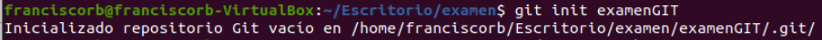

# README

# Ejercicio 1. Repositorio local. (3 ptos.)

### 1. Crea un repositorio local llamado examenGIT

### 2. Sobre este repositorio crea un fichero llamado nombre.txt con tu nombre

### 3. Confirma los cambios

### 4. Crea una nueva rama llamada apellidos

### 5. En la rama apellidos, modifica el fichero nombre.txt y añade tus apellidos.

### 6. Crea un nuevo fichero llamado curso.txt y añade el curso en el que estás.

### 7. Visualiza las ramas.

### 8. Vuelve a la rama principal y crea un fichero llamado modulo.txt donde pongas el nombre de este módulo profesional.

### 9. Fusiona las ramas para dejar únicamente la principal.

### 10. Visualiza un grafo con todas las ramas.

## Ejercicio 2. Repositorio remoto. (4 ptos.)

### A partir de tu repositorio examenGIT y utilizando VS Code:

### 1. Conecta tu repositorio local a uno remoto que crees en Github.

### 2. Haz el primer commit y push para añadir todos los ficheros actuales.

**3. Comprueba que esté todo en Github.**

### 4. En una rama nueva, crea un fichero git.html con el contenido: "Examen Git”

### 5. Visualiza el estado del repositorio local

### 6. Añade git.html a la zona de intercambio.

### 7. Modifícalo y añade una nueva línea con tu correo.

### 8. Visualiza el estado de nuevo.

### 9. Confirma en el repositorio local.

### 10. Publica los cambios en el repositorio remoto.

### 11. Visualiza un grafo con todas las ramas.

### 12. Vuelve a la rama principal y crea un fichero llamado pasos.txt donde pongas los pasos de este ejercicio.

### 13. Confirma en el repositorio local.

### 14. Publica los cambios en el repositorio remoto.

### 15. Para terminar fusiona las dos ramas para quedarte solo con la principal, tanto en local como en el repositorio remoto

### 16. Visualiza el grafo con todos los commits desde VS Code .

### git log y git log --graph --all - Ejercicio 2

